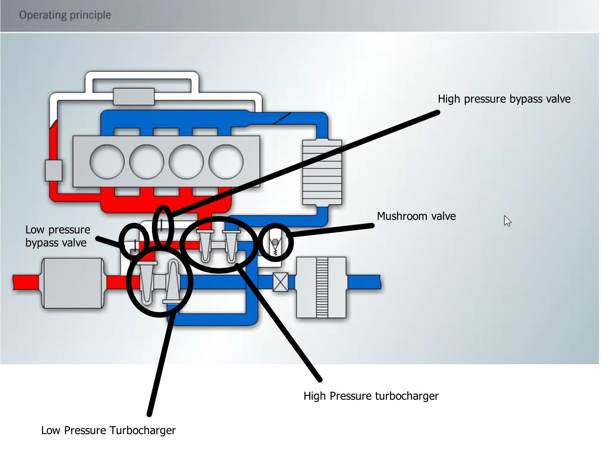

# How turbocharged engines work

-Tejas Shastry

## Engine design

### Basic

### Labled

## Parts explained

### Low Presssure Turbocharger

This is a bigger and higher movement-of-inertia turbo charger that can extact power from gases of higher velocity and volume well but does not work well with low velocity/volume gas that is prevalent in slow/idling mode

### High Pressure Turbocharger

This is a smaller turbocharger designed to extract all power from the gases when engine RPM is still low. This turbocharger overcomes the problem of "turbo lag". This occurs when engine RPM is still slow and the low pressure turbocharger is not effective in energy capture. 

### Bypass valves

These valves allow exaust gases to escape intry into their respective turbocharger. Meaning, when say the High Pressure Bypass Valve is open, the exaust gas can escape go directly to the low pressure turbocharger instead of going through higp pressure turbocharger.

Thus it is "passing BY" the HP turbocharger(thuss the term bypass) as oppoed to "passing THROUGH" the HP turbocharger

### Mushroom valve

Allows intake gases to go directly to engine insted of through the HP turbocharger

## Stages

### Low RPM(idling/slow)

During idling, the amount of air flowing through engine is not very high velocity. Thus all valves are vlosed so that all air flows throgh high pressure turbocharger(HPT) first and then low pressure. This way the HPT, which can more effeciently hande low velocity gas extracts the most amount of energy from the turbochager. The low pressure turbocharger(LPT) is barely moving as most of the energy in the gas is alredy absorbed.

### Mid RPM

The high pressure bypass valve now starts to open, allowing some gas to move throgh low pressure turbocharger directly. This is because low  pressure turbocharger is better equipped to handle this higher velocity gas. As the gas keeps getting faster(engine RPM increases), The high pressure bypass valve opens more and more allowing more gas to go directly to LP turbocharger . Thus the low pressure valve start to play a more and more dominant role.

### High RPM

Now the load on the low pressure valve starts reaching its limits. At this point high pressure bypass valve is laready opened to its max. Now the low pressure bypass valve starts to open slowly, relieving load on the LPT.

### Extreme RPM

When both valves are open and the HPT is still being over-exerted(exceeded max capacity), the mushroom valve opens finally relieveing pressure on the HPT and allowing the intake gases to go directly to engine. This hapens is when the car is moving at very high speed and energy coming from the velocity of intake gases is too much for the HPT to handle

When this happens,

The engine does this

THIS DOCUMENT IS MEANT FOR INTERNAL CIRCULATION IN RVCE
